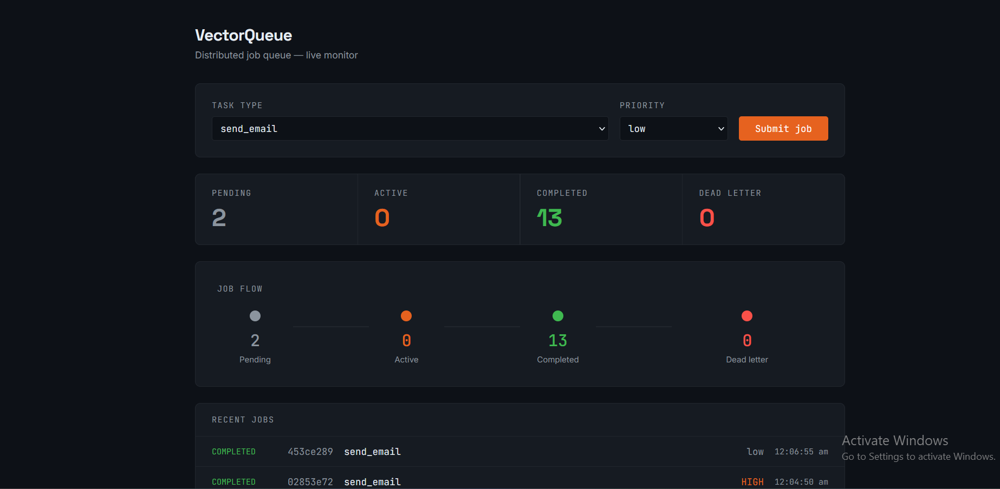

# VectorQueue

A distributed job queue and task scheduler built from scratch — no Celery, no BullMQ, no Sidekiq. Just Redis primitives, Postgres, and the mechanics that make production queue systems reliable.

**Live demo:** https://vector-queue.vercel.app

**Dashboard preview:** 

---

## Why this exists

Most backend systems eventually need to run work outside the request/response cycle — sending emails, processing files, retrying failed calls. Production systems solve this with job queues, but most engineers only ever *use* one (Celery, BullMQ) without understanding what's happening underneath.

VectorQueue is my attempt to understand and rebuild those internals: atomic job claiming across multiple workers, crash recovery, exponential backoff, dead-letter handling, and priority scheduling — all built directly on Redis data structures rather than a queue library.

---

## Architecture

```
                    ┌─────────────┐
   POST /jobs  ───▶│ Express API  │
                    └──────┬──────┘
                           │ writes job record
                           ▼
                    ┌─────────────┐
                    │  PostgreSQL │◀──────────────┐
                    │ (source of  │                │
                    │   truth)    │                │ status updates
                    └─────────────┘                │  + event log
                           │                       │
                           │ pushes job            │
                           ▼                       │
                 ┌───────────────────┐             │
                 │  Redis (broker)   │             │
                 │ jobs:high/low     │             │
                 │ processing        │             │
                 │ delayed_jobs(ZSET)│             │
                 │  dead_letter      │             │
                 └─────────┬─────────┘             │
                           │ LMOVE (atomic claim)  │
                 ┌─────────┴─────────┐             │
                 ▼                   ▼             │
           ┌───────────┐      ┌───────────┐        │
           │  Worker 1 │      │  Worker 2 │────────┘
           └───────────┘      └───────────┘
                 ▲                   ▲
                 └─────────┬─────────┘
                           │ checks every 1s
                    ┌─────────────┐
                    │  Scheduler  │  (requeues delayed/retry jobs)
                    └─────────────┘
```

Postgres is the source of truth for job state and full history. Redis is the fast-moving broker that workers actually poll against. This separation is deliberate — Redis operations are cheap and fast for queue mechanics, but transient; Postgres gives you a permanent, queryable audit trail that survives restarts.

---

## Core features

**Queue mechanics**
- FIFO job queue using Redis Lists (`LPUSH` / `LMOVE`)
- Priority lanes — `jobs:high` always checked before `jobs:low`
- Delayed/scheduled jobs using Redis Sorted Sets, scored by run-at timestamp

**Reliability**
- **Atomic multi-worker claiming** via `LMOVE`, guaranteeing no two workers ever process the same job — proven by running concurrent workers against a shared queue with zero duplicate processing
- **Crash detection & recovery** — jobs claimed by a worker are tracked with a claim timestamp; if a worker dies mid-job, a background process detects the stale claim and requeues it after a timeout window
- **Retry with exponential backoff** — failed jobs are rescheduled with growing delays (2s → 4s → 8s...) via the delayed-jobs sorted set
- **Dead-letter queue** — jobs that exceed max retries are moved to a permanent `dead_letter` list instead of retrying forever
- **Per-queue concurrency limits** — cap how many jobs of a given task type run simultaneously
- **Graceful shutdown** — workers catch `SIGINT`/`SIGTERM`, finish their current job, then exit cleanly, avoiding orphaned "stuck" jobs on normal restarts

**Persistence & API**
- Full job lifecycle and event history in PostgreSQL (`jobs`, `job_events` tables)
- REST API: `POST /jobs`, `GET /jobs`, `GET /jobs/:id`, `GET /stats`

**Dashboard**
- Live-updating React dashboard — job flow visualization (pending → active → completed/dead-letter), stat counters, job submission form, recent job log

**Infrastructure**
- Fully Dockerized — one command (`docker compose up`) starts Redis, the API, two workers, and the scheduler together

---

## A real bug I hit

Early on, retried jobs would vanish into a queue that was never checked. Priority lanes (`jobs:high` / `jobs:low`) had replaced a single `jobs` list — but the scheduler's requeue logic still pushed retried jobs back into the old, now-dead `jobs` key. Workers only ever polled the priority lanes, so retried jobs sat invisible in Redis, and the priority itself wasn't even being carried inside the job payload across the retry path.

Fix: embed `priority` directly in the job's JSON payload at creation time, and have the scheduler read it back out to route retried jobs to the correct lane. This is the exact kind of bug that surfaces in real distributed systems — implicit assumptions about data shape breaking silently across independent components — and it's the reason I now think of every field on a job as something that must survive **every** hop it can take (queue → processing → delayed → back to queue), not just the happy path.

---

## Tech stack

| Layer | Tech | Why |
|---|---|---|
| Broker | Redis 7 | Fast in-memory ops, Lists + Sorted Sets map naturally to queue/scheduling semantics |
| Persistence | PostgreSQL (Supabase) | Durable source of truth, queryable job history |
| API | Node.js + Express | Lightweight, direct control over queue mechanics |
| Frontend | React + Tailwind | Live dashboard for monitoring and manual job submission |
| Infra | Docker Compose | One-command multi-service startup |

---

## Running it locally

**Prerequisites:** Docker Desktop, a Postgres connection string (e.g. from [Supabase](https://supabase.com))

1. Clone the repo
   ```
   git clone https://github.com/0kartik/VectorQueue.git
   cd VectorQueue
   ```

2. Create a `.env` file in the project root:
   ```
   DATABASE_URL=postgresql://<user>:<password>@<host>:<port>/postgres
   ```

3. Run the schema setup (see `backend/schema.sql`) against your Postgres instance.

4. Start everything:
   ```
   docker compose up --build
   ```

5. API available at `http://localhost:3000`. To run the dashboard:
   ```
   cd dashboard
   npm install
   npm run dev
   ```

---

## API reference

| Method | Endpoint | Description |
|---|---|---|
| `POST` | `/jobs` | Create a job — body: `{ task, payload, priority }` |
| `GET` | `/jobs` | List jobs, optional `?status=` filter |
| `GET` | `/jobs/:id` | Get a single job with its full event timeline |
| `GET` | `/stats` | Aggregate job counts by status |

---

## What I'd build next

- Idempotency keys to prevent duplicate side effects on retried jobs
- Per-worker health/heartbeat visible in the dashboard
- Horizontal scaling test harness (spin up N workers, measure throughput)
- Rate limiting per task type, not just concurrency caps

---

## Author

Built by [Janardan Kartikeya Agnihotram](https://github.com/0kartik)
